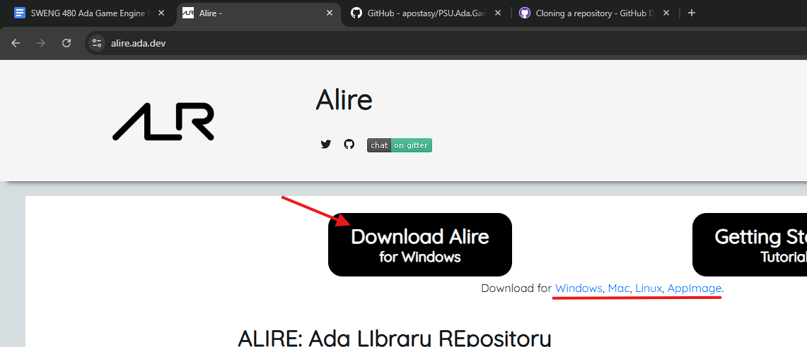
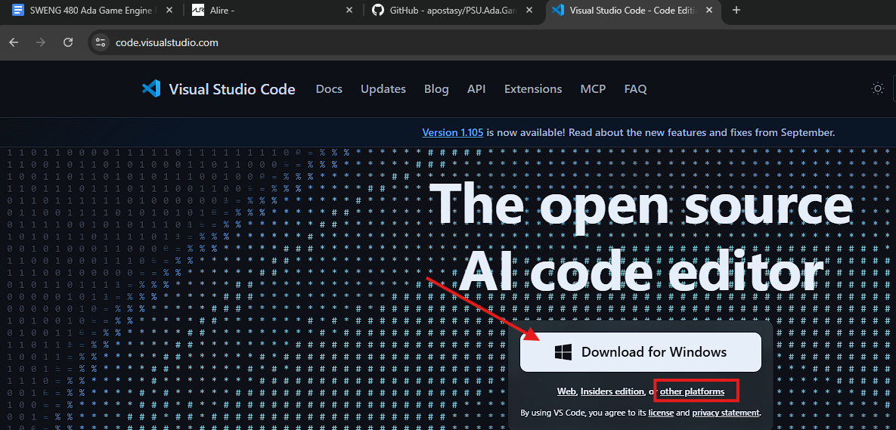
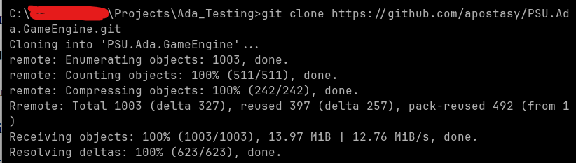
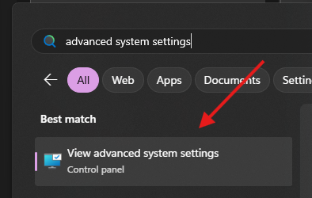
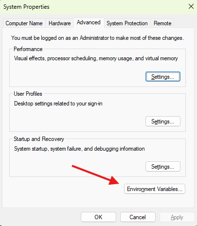
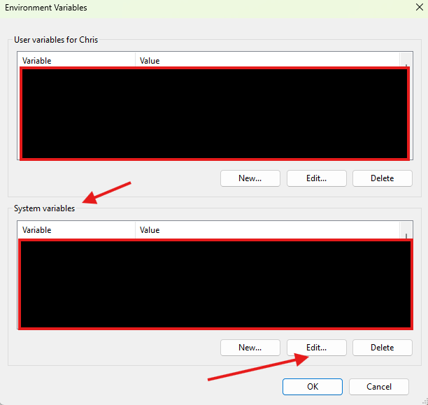
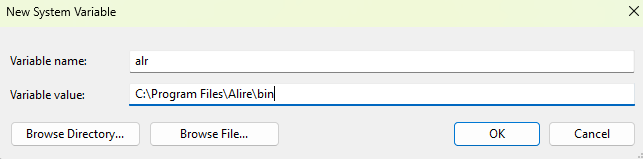
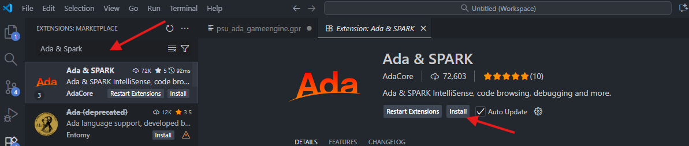
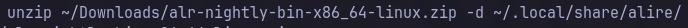
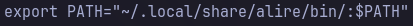

# PSU.Ada.GameEngine
## Setup Development Environment
### Windows
#### Install Alire
1. Download and install Alire for the correct operation system from https://alire.ada.dev.
  

2. Download and install Visual Studio Code from https://code.visualstudio.com


3. Clone the Ada GameEngine repo into your project with the following command “git clone https://github.com/apostasy/PSU.Ada.GameEngine.git”


4. Add alr.exe to the PATH environment variables
a. Open the start menu and search for “advanced system settings.”
b. Select “View Advanced System Settings” in the control panel from the Start menu.

c. In the Advanced System Settings menu, click on “Environment Variables” in the bottom right of the window

d. Under system variables, select the “Path” variable and click “Edit.” 

e. Click “New” to add a new system variable and locate the file path for alr.exe.
   (Ex: “C:\Program Files\Alire\bin”) 

f. Close out of any open terminals and VS Code for these changes to take effect

#### Install VS Code
1. Download from https://code.visualstudio.com/ and install

#### VS Code Extensions 
1. Open VS Code and install the following extension: Ada & SPARK from AdaCore



### Linux
#### Install Alire
1. Download and install Alire for the correct operating system from https://alire.ada.dev


2. Once downloaded extract the file 


3. Add alr as environment path


#### Install VS Code
Arch >
> $ sudo pacman -S code

Debain based systems
> $ sudo apt install code

Fedora based systems
> $ sudo yum install code

Install additional VS Code pacakges and cloing repo will the be the same as with Windows

## Using the library

* You can use the Demos folder as an example
* Create a new binary project within this project with `alr init project_title`
* Add a pin to your project's alire.toml file for this library
    ```
    [[pins]] 
    psu_ada_gameengine = { path='..' } 
    ```
* Reference the library in your project's gpr file
    ```
    with "../psu_ada_gameengine.gpr";
    ```

## Examples

### Animation Test


### Camera Test


### Arkanoid Clone


**Credits:**  
Textures ripped by **Superjustinbros**, available at [The Spriters Resource](https://www.spriters-resource.com/arcade/arkanoid/).


